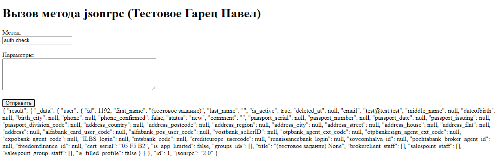
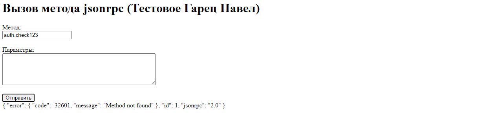
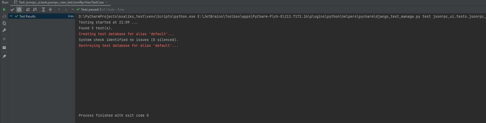
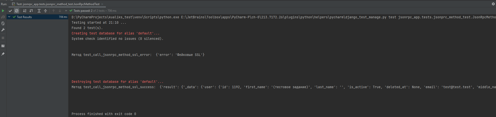

### Описание тестового задания

Создать Django-проект, при помощи которого используя jsonrpc-2.0 ( ендпоинт: https://slb.medv.ru/api/v2/ ) можно вызвать 
удалённый метод api с использованием для авторизации приложенной пары сертификат+ключ (т.н. "двусторонний TLS").

Для примера можно вызывать jsonrpc-2.0 метод "auth.check".

Успешный вызов означает пройденную авторизацию и возврат не-error ответа.
### Требования к реализации:
- Содержимое(!) сертификата и ключа прописывается где-то в одном из модулей проекта (например, в settings.py) в виде 
двух текстовых переменных (не в виде путей к файлам).
Для всего проекта использовать только стандартную библиотеку python (помимо django).

### Рекомендации к реализации:
- Django-часть: примитивный UI одностраничный: одна html-форма (поле имя метода + submit + возможно параметры метода) + отображение результата.
- Реализация метода вызова api должна быть похожа на повторно используемый код для вызова любого jsonrpc-метода на любом 
endpoint с примитивной обработкой ошибок и т.п. (в виде отдельного модуля или в виде отдельного django-аппа).

### Для работы проекта потребуются:

- Python
- Django
- Dotenv
- Requests


### Полезные команды в консоли:
<details>
  <summary>Команды для тестирования</summary>
  <p>Запуск тестов для тестирования вызовов jsonprc методов с использованием SSL.

    python manage.py test jsonrpc_app.tests.jsonprc_method_test
  </p>
  <p>Запуск тестов для тестирования представления с использованием SSL.

    python manage.py test jsonrpc_ui.tests.jsonrpc_view_test
  </p>
</details>

<details>
  <summary>Команда для запуска сервера</summary>

  <p>По дефолтному порту

    python manage.py runserver
  </p>
</details>


# Запуск проекта локально

1. Клонировать проект:
    ```
    git clone https://github.com/EchoFoe/kualiks_test.git
    ```
2. Создайте виртуальное окружение в корне проекта (зависит от вашей ОС) и установите зависимости
    ```
    pip install -r requirements.txt
    ```
3. Создайте в корне проекта файл `.env` (использует python-dotenv) и укажите свои конфиги
    ```
    SECRET_KEY=your_django_secret_key
    TEST_API_URL=https://slb.medv.ru/api/v2/
    CLIENT_2024_TEST_KEY=your_client_key
    CLIENT_2024_TEST_CRT=your_crt
   ```
   #### (!) - Я скинул настройки для сертификата и ключа Сирарпи, можно просто скопировать и вставить

4. Произведите миграции:
    ```
    python manage.py migrate 
    ```

5. Запустить сервер разработки:
    ```
    python manage.py runserver 
    ```
   
На интерфейсе заполните поле "метод". Если Вы увидите что-то типа этого, то это говорит об успешном ответе:



В иноме случае увидите ошибку:



6. Запустите тест-кейсы для проверки работоспособности (можно через IDE, можно через консоль (команды ниже)):
 
Для проверки представления
 ```
 python manage.py test jsonrpc_ui.tests.jsonrpc_view_test 
 ```



Для проверки метода

 ```
 python manage.py test jsonrpc_app.tests.jsonprc_method_test 
 ```


